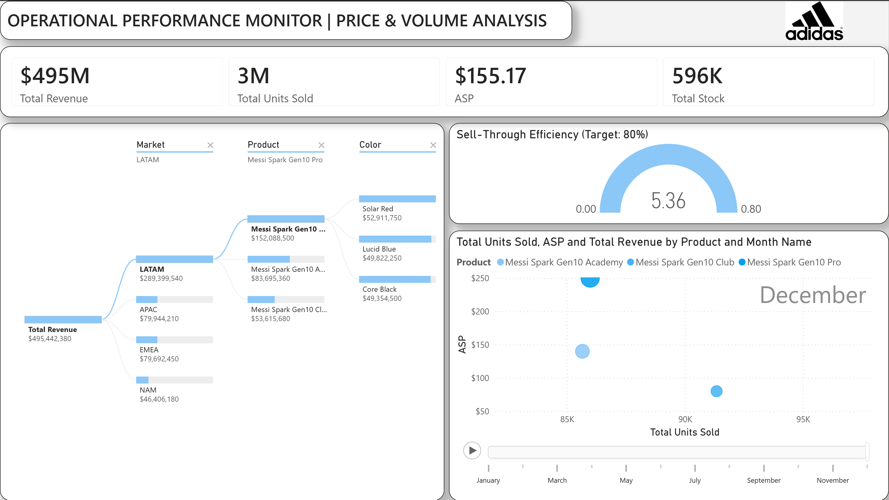

# 🚀 Project Spark: Global Supply Chain Control Tower

## 💼 Executive Summary
**Project Spark** is a strategic analytics initiative designed to identify and resolve a **$40M+ revenue leakage** event during a global product launch.

Facing a disconnect between ERP inventory reports and regional sales realities, this project deployed a **Supply Chain Control Tower** to audit the distribution network. The analysis uncovered a critical allocation failure: **85% of global inventory was stagnant in North America, while high-demand Latin American markets faced 970% demand-to-supply deficits.**

*Figure 1: Executive Control Tower showing the inventory disparity between NAM (Grey) and LATAM (Black).*

---

## 📉 The Business Case
### **The Scenario**
Following the synchronized launch of the "Messi Spark Gen10" footwear line across 4 global markets (NAM, EMEA, LATAM, APAC), the organization faced a supply chain paradox:
* **ERP Data:** Reported healthy "Weeks of Cover" (WOC) globally.
* **Market Reality:** Regional Directors in LATAM reported immediate stock-outs, while NAM warehouses incurred rising storage costs for slow-moving inventory.

### **The Data Challenge**
Strategic decision-making was paralyzed by fragmented data silos. Sales velocity, inventory snapshots, and logistics holds were isolated in disparate systems with mismatched currencies (COP, JPY, EUR, USD) and dirty Master Data (SKU conflicts), rendering standard reporting useless.

---

## 🛠️ Technical Architecture: The "Dual-Threat" Approach
To demonstrate enterprise versatility, this project employs two distinct ETL methodologies to solve the same business problem.

### **Method A: Python-First (The Code Approach)**
* **Simulation Engine:** Developed a Python script (`pandas`, `numpy`) to generate **100,000+ transaction rows**, simulating real-world complexities including seasonality, price elasticity, and customs delays.
* **ETL Pipeline:** Engineered a cleaning algorithm to normalize multi-currency P&L data and resolve SKU conflicts before ingestion.

### **Method B: Power Query (The Low-Code Approach)**
* **Direct Ingestion:** Connected Power BI directly to raw, unstructured CSV sources.
* **M-Language Transformation:** Utilized Power Query Editor to perform currency conversion (`if [Currency] = "COP"...`), text parsing, and conditional logic entirely within the BI semantic model.
* **Operational Dashboard:** Designed a secondary "Operations Monitor" focusing on drill-down granularity for regional managers.

*Figure 3: Operational Drill-Down Dashboard showing Price vs. Volume elasticity.*

---

## 📊 Strategic Insights & Conclusions
The analysis delivered three critical findings that contradicted the initial allocation strategy:

### **1. The Allocation Efficiency Failure**
* **Observation:** North America (NAM) received the bulk of allocation based on GDP weighting.
* **Result:** NAM holds **~350,000 units** but achieved a Sell-Through Rate of only **0.07 (7%)**.
* **Conclusion:** The market is saturated. The inventory is currently classified as "Dead Stock" burning margin on storage fees.

### **2. The "LATAM Paradox" (Revenue Opportunity)**
* **Observation:** Latin America (LATAM) received <5% of global stock.
* **Result:** Demand outstripped supply by a factor of **10x** (STR > 900%).
* **Conclusion:** An estimated **$15M - $20M in revenue** is currently being lost due to stock-outs in high-affinity markets.

### **3. Logistics Bottlenecks ("Ghost Stock")**
* **Observation:** **62,000 Units** are visible in inventory but not sellable.
* **Result:** Geographic analysis pinpoints these units are "Blocked" in customs at LATAM and APAC ports.
* **Action:** Immediate deployment of logistics expediters is required to release this capital.

---

## 🚀 Usage Instructions
Data Simulation: Run `Source/data_generator_SCM.py` to refresh the dataset.

Pipeline Execution: Run `Source/etl_pipeline_SCM.py` to clean data for Method A.

Visualization: Open either .pbix file to explore the models.

Disclaimer: This project utilizes synthetic data generated via Python to simulate real-world supply chain optimization scenarios for portfolio demonstration.
